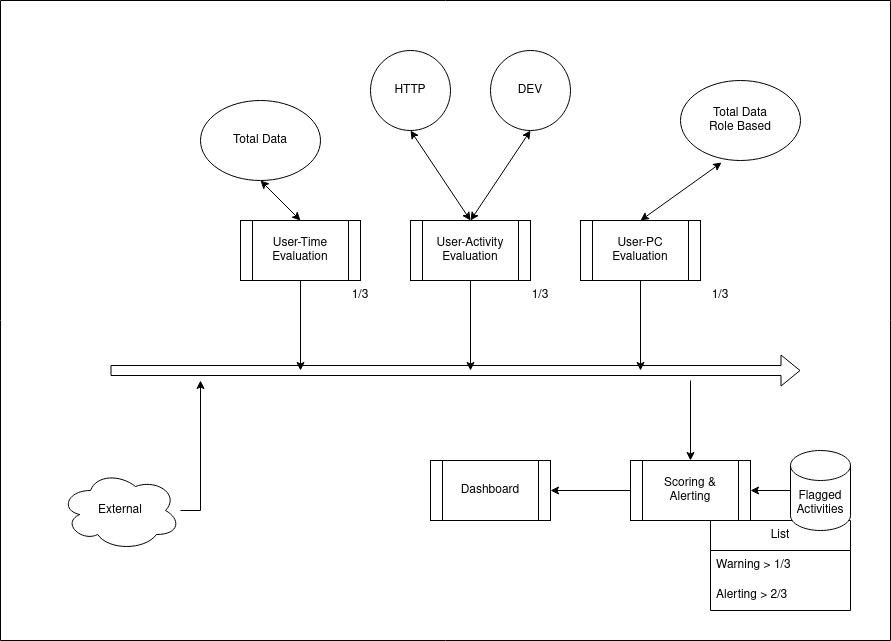
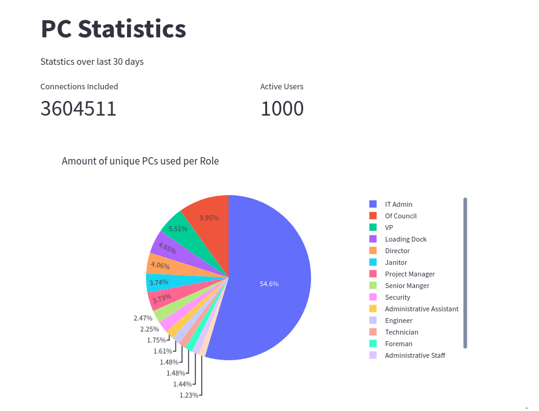
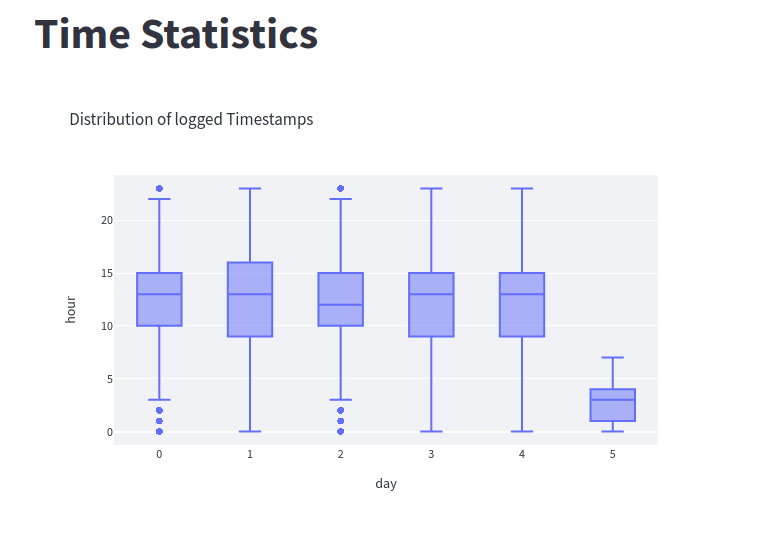

# Real-time threat detection
- [Real-time threat detection](#real-time-threat-detection)
  - [Foreward](#foreward)
  - [Quick Glance](#quick-glance)
  - [Further Improvements](#further-improvements)
  - [Setup](#setup)
  - [Contributors](#contributors)

## Foreward
For Data Analytics Hackathon our Challenge requirement was to detect an insider privilege missuse detection based on the dataset provided by Lindauer, Brian (2020): Insider Threat Test Dataset[[1]]. Keep in might that the code and this repistory was done and collaborated on by multiple people and within a timeframe of like two and a half days so it is kind of a mess. Nonetheless it is released the way it was finished for the hackathon. We might update the project with further improvements in the future but will keep this state of code for the sake of transparency. The breakdown of steps how the problem was solved might be helpful on how to design such systems.

[1]: https://kilthub.cmu.edu/articles/dataset/Insider_Threat_Test_Dataset/12841247/1

## Quick Glance
The initial idea was to leverage some form of anomoly detection to identify outliers in the dataset. That is based on the assumption that the behaviour of insiders is different from typical behaviour which should account for the most of the logged traffic in an enterprise network. Allthough there are labels available for the use with a supervised approach this is somewhat not ideal from a business point of view where labeled insiders already did the damage before being available in the dataset. There was the possibility to aggregate the logs to user sessions by using the login and logoff event of ldap log. Nevertheless we made the decision to analyze every datapoint in realtime as it was produced by a source system instead of aggregating to sessions, so a bad action is identified immideatly and not after the session finished. The approach is depicted using the following diagram:



We created our proof of concept as a real-time outlier detection system with the following aspects in mind:

1. Every datapoint and the dimensions like the user, the used pc, the time and the acitivity gets evaluated on its own. Then the sum is calculated into an overall score.
2. The Data is guided over all componennts by using a Dataflow to allow for realtime processing aswell as backtesting of changes to the overall scoring system in batch processing.
3. A timestamp is present on every event flowing through the system. The overall distribution of all timestamps was calculated by getting the day of week and the hour of that timestamp which then get counted and descendingly sorted to get top n%. 
4. For activities the evaluation was divided into two parts: We counted visited websites and generated top n% webpages to rank everything that is not in p96 as outliers where p99 will get a higher score than p97. For Devices we assumed that every usb connection event is somewhat negative. Then the score gets reduced by a factor of how frequently the role the user belongs to connects usb devices.
5. In a similar manner the usage of the pc got evaluated. The assumption was made that the usage of a new pc (not used by that user in last 30d) is somewhat negative. This components score got reduced by a factor of how many pcs a user's role is typically using. E.g. In this dataset the role of admin tends to connect to way more systems than the role of janitor does.
6. The system was designed to allow the usage of static systems like bad link lists to further influence the overall score in conjunction with this anomoly based approach.
7. We keep only the events in our frontend that scored highly and keep everything else in the lifecycle of the underlying message queue to account for some sort of protection of personal data.  
8. With this approach the learned distributions and features of the system should be updated periodically in batch or directly calculated on streaming to amount for the changing environment that is present in an enterprise network. E.g. a new site is created in a different timezone. 

The system works without the usage of state of the art machine learning and leverages only pandas and statistics to score events.
One of our first attempts included machine learning technologies like isolation forests without having much success as the used dataset was not suited. And as Chip Huyen said in Desinging Machine Learning Systems[[2]]: 
"While it’s essential to stay up to date with new technologies and beneficial to evaluate them for your business,
the most important thing to do when solving a problem is finding solutions that can solve that problem."
So we did exactly this!

[1]: https://www.oreilly.com/library/view/designing-machine-learning/9781098107956/

| Alerts Dashboard | Distribution of USB Connections | Distribution of PC Usage | Distribution of Timestamps |
|--------------------------------------|--------------------------------------|--------------------------------------|--------------------------------------|
|  |  |  |  |


## Further Improvements

In a production environment this system has to handle a lot of data throughput. In a last minute effort to increase the throughput we merged all checks into one api call. This can be further improved by doing the checks in memory of the dataflow, discarding the usage of http completely. Furthermore the dataflow is able to be used in multiple threads, maybe a partitioned kafka topic. 

The anomaly score can be used in conjunction with static systems like a list of bad webpages (here shown as an external system) to further improve the overall performance. The system then might be able to account for situations where people have knowledge about the way that scoring system works e.g. influencing the distribution of abnormal webpages by visiting the pages frequently at a common date and time.


## Setup

To download the required data and create a database run the following:
```
make data
```

In a new terminal start the backend:
```
(cd backend && uvicorn app:app --reload)
```

Wait completion of application startup. (This takes a while)
And run the dataflow to run some sample data through the system.
```
(cd dataflow && python dataflow.py)
```

Finally run the frontend in a new terminal
```
(cd frontend && python -m streamlit run 01_Misuse_Events.py)
```

Once finished, kill the terminals and clear the database:
```
make clean
```

## Contributors

Mark S,
Gökhan K,
Manuel S,
Deniz D,
Luis V,
Pierre R
